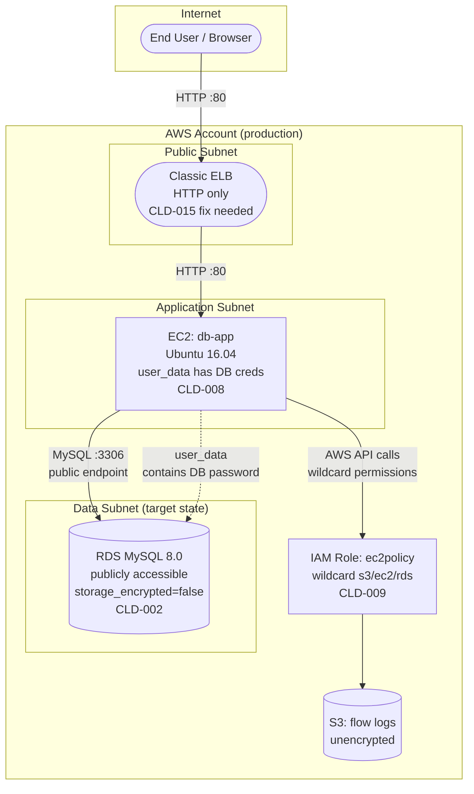

# Module 9 — Threat Model: Workload "db-app" (RDS + EC2 Web Application)

## Chosen methodology

This threat model uses **STRIDE** (Spoofing, Tampering, Repudiation, Information Disclosure, Denial of Service, Elevation of Privilege). STRIDE was chosen because it provides systematic coverage of threat categories against data flow elements, which is the right level of rigor for a workload-level assessment of this estate. It is also the methodology most directly mapable to the Module 1 findings register.

## Scope: the "db-app" workload

The "db-app" workload is selected because it directly matches the programme's audit trigger: it contains the public, unencrypted RDS instance (`CLD-002`) with committed database credentials (`CLD-007`, `CLD-008`) and an EC2 instance with wildcard IAM role (`CLD-009`). It represents the highest-risk workload in the reference target.

## Data flow diagram

## STRIDE threat analysis

### Threat 1 — Spoofing: Attacker impersonates a legitimate user to the web application

| Attribute | Detail |
|---|---|
| **STRIDE category** | Spoofing |
| **Data flow element** | User → ELB (HTTP, no client auth) |
| **Description** | The Classic ELB terminates HTTP on port 80 with no HTTPS listener (`CLD-015`). An attacker on the network path can intercept and modify traffic, or impersonate a legitimate user by replaying HTTP requests. There is no client certificate or OAuth/OIDC enforcement at the edge. |
| **Likelihood** | High — HTTP is trivially interceptable on any shared network. |
| **Impact** | High — session hijack, credential theft, unauthorised application access. |
| **Existing control** | None at the application edge. The ELB has no TLS termination and no authentication layer. |
| **Proposed control** | Add HTTPS listener with ACM certificate. Redirect HTTP→HTTPS. Add WAF and authentication at the edge (Module 4: public edge tier with WAF). |
| **Residual risk** | Low after TLS + WAF + authentication are deployed. |

### Threat 2 — Tampering: Attacker modifies database data in transit or at rest

| Attribute | Detail |
|---|---|
| **STRIDE category** | Tampering |
| **Data flow element** | EC2 → RDS (MySQL :3306, no TLS enforced) |
| **Description** | The RDS instance does not enforce TLS (`rds.force_ssl` not set). An attacker who can intercept traffic between EC2 and RDS (e.g., via compromised network path or ARP spoofing within the VPC) can modify queries and results in transit. At rest, `storage_encrypted = false` means an attacker with storage access can modify data files directly. |
| **Likelihood** | Medium — requires network position or storage access. |
| **Impact** | Critical — financial reconciliation data is modified without detection. |
| **Existing control** | None. No TLS enforcement, no encryption at rest, no integrity verification. |
| **Proposed control** | `rds.force_ssl = 1` (Module 5). `storage_encrypted = true` with CMK. RDS Audit Logs enabled for query-level integrity monitoring. |
| **Residual risk** | Low after TLS + encryption + audit logging. |

### Threat 3 — Repudiation: Database access cannot be attributed to a specific actor

| Attribute | Detail |
|---|---|
| **STRIDE category** | Repudiation |
| **Data flow element** | EC2 → RDS (no per-query audit trail) |
| **Description** | The RDS instance does not have audit logging enabled. If data is accessed, modified, or exfiltrated, there is no database-level log showing who ran which query. The only log source is the EC2 instance's application log, which may not capture database-level operations. |
| **Likelihood** | High — this is already the status quo. |
| **Impact** | High — the programme cannot demonstrate who accessed data, making incident investigation and compliance evidence impossible. |
| **Existing control** | None at the database level. CloudTrail captures AWS API calls but not SQL queries. |
| **Proposed control** | Enable RDS Audit Logs and slow query logs. Ship to CloudWatch Logs → central SIEM (Module 6). Enable Performance Insights for query-level visibility. |
| **Residual risk** | Low after audit logging and SIEM integration. |

### Threat 4 — Information Disclosure: Database credentials and data exposed through multiple paths

| Attribute | Detail |
|---|---|
| **STRIDE category** | Information Disclosure |
| **Data flow element** | EC2 user_data → RDS password (`CLD-007`, `CLD-008`); RDS public endpoint → internet (`CLD-002`) |
| **Description** | This is a multi-path information disclosure threat. (a) The database password is embedded in EC2 user_data (`CLD-008`) and retrievable via instance metadata (IMDSv1 by default on older instances). (b) The password is also a Terraform variable default (`CLD-007`), visible in source control and state files. (c) The RDS instance has `publicly_accessible = true`, meaning the endpoint resolves from the public internet. (d) `storage_encrypted = false` means data at rest is in cleartext. An attacker needs only one of these paths to access the data. |
| **Likelihood** | Critical — multiple independent paths to credential/data exposure all exist simultaneously. |
| **Impact** | Critical — full database compromise, data exfiltration, potential citizen data exposure. |
| **Existing control** | None effective. The security group technically restricts port 3306, but `publicly_accessible = true` means the endpoint is DNS-resolvable from the internet. |
| **Proposed control** | Module 3: remove committed credentials, use Secrets Manager. Module 4: `publicly_accessible = false`, private subnet only. Module 5: `storage_encrypted = true`. Module 2: pipeline blocks committed secrets. |
| **Residual risk** | Low after all Module 2/3/4/5 controls are applied. |

### Threat 5 — Denial of Service: Public RDS instance targeted by brute force or resource exhaustion

| Attribute | Detail |
|---|---|
| **STRIDE category** | Denial of Service |
| **Data flow element** | Internet → RDS (public endpoint, `CLD-002`) |
| **Description** | The RDS instance is publicly accessible with a weak, committed password. An attacker can flood the instance with authentication attempts, exhausting connection slots and CPU, making the database unavailable to the legitimate application. |
| **Likelihood** | High — the endpoint is public and the password is known. |
| **Impact** | High — the financial reconciliation tool cannot operate, blocking business-critical processes. |
| **Existing control** | None. No connection throttling, no WAF on the database endpoint, no rate limiting. |
| **Proposed control** | Module 4: `publicly_accessible = false`, private subnet. This eliminates the internet-based DoS path entirely. If internal DoS is a concern, add RDS Proxy for connection pooling. |
| **Residual risk** | Low — once the database is private, internet-based DoS is impossible. |

### Threat 6 — Elevation of Privilege: Compromised EC2 instance escalates via wildcard IAM role

| Attribute | Detail |
|---|---|
| **STRIDE category** | Elevation of Privilege |
| **Data flow element** | EC2 → IAM Role (`ec2policy`, `CLD-009`: `s3:*`, `ec2:*`, `rds:*` on `*`) |
| **Description** | The EC2 instance's attached IAM role grants wildcard permissions across S3, EC2, and RDS for all resources. If an attacker compromises the web application (e.g., via SQL injection on the PHP app, or by extracting credentials from user_data), they automatically inherit these broad permissions. They can enumerate and access every S3 bucket, modify every RDS instance, and launch/terminate any EC2 instance in the account. |
| **Likelihood** | High — the web application runs PHP on Ubuntu 16.04 (EOL, `CLD-010` pattern) with known vulnerabilities, and the IAM role is already overly broad. |
| **Impact** | Critical — full account compromise. Lateral movement to every workload in the AWS account. |
| **Existing control** | None. The IAM role is maximally permissive with no resource conditions. |
| **Proposed control** | Module 3: replace with scoped `ci-deploy-workload` role. Resource conditions by tag. Deny statement for IAM mutations. Separation of plan/deploy roles. |
| **Residual risk** | Low after IAM scoping. Some residual risk remains because the workload role still needs write access to its own resources. |

### Threat 7 — Tampering: Attacker modifies EC2 instance configuration via user_data manipulation

| Attribute | Detail |
|---|---|
| **STRIDE category** | Tampering |
| **Data flow element** | EC2 user_data (contains PHP config, DB credentials, application setup) |
| **Description** | The user_data script writes database credentials and PHP configuration directly to disk (`CLD-008`). An attacker with EC2 `DescribeInstanceAttribute` permission (which the wildcard `ec2policy` role grants) can read the user_data and extract credentials. More critically, if an attacker can modify the Terraform template or the S3 bucket where user_data scripts are stored, they can inject malicious configuration into every new instance launch. |
| **Likelihood** | Medium — requires Terraform/S3 compromise or insider access. |
| **Impact** | High — persistent backdoor in the application configuration, credential theft. |
| **Existing control** | None. user_data is not integrity-verified after launch. |
| **Proposed control** | Module 3: remove credentials from user_data. Retrieve from Secrets Manager at boot. IMDSv2 enforced. S3 bucket with versioning and object lock for deployment artifacts. |
| **Residual risk** | Low after Secrets Manager migration and IMDSv2. |

### Threat 8 — Information Disclosure: Sensitive data in unencrypted EBS snapshot shared or leaked

| Attribute | Detail |
|---|---|
| **STRIDE category** | Information Disclosure |
| **Data flow element** | EBS volume → EBS snapshot (`CLD-018`: unencrypted) |
| **Description** | The EBS volume attached to the EC2 instance is unencrypted, and the snapshot taken from it is also unencrypted. If the snapshot is shared with another account (accidentally or maliciously), or if the underlying storage media is accessed, all data — including the application files, logs, and any secrets written to disk by user_data — is readable in cleartext. |
| **Likelihood** | Medium — requires snapshot sharing misconfiguration or physical access. |
| **Impact** | High — application source code, configuration, and potentially database credentials (written to disk by `CLD-008`) are exposed. |
| **Existing control** | None. No encryption, no snapshot sharing restrictions. |
| **Proposed control** | Module 5: `encrypted = true` on EBS volumes. Account-level `aws_ebs_encryption_by_default = true`. OPA policy denies unencrypted snapshots. |
| **Residual risk** | Low after default encryption and OPA enforcement. |

### Threat 9 — Spoofing: Attacker uses stolen CI credentials to access production resources

| Attribute | Detail |
|---|---|
| **STRIDE category** | Spoofing |
| **Data flow element** | CI pipeline → AWS API (via wildcard IAM user from `CLD-003`) |
| **Description** | The CI service account has static access keys (`CLD-004`) with wildcard permissions (`CLD-003`). If these keys are leaked (they are committed in source control), an attacker can authenticate as the CI identity and perform any action the role allows — including accessing the production database, modifying infrastructure, or exfiltrating data from S3. This is the exact scenario walked through in Module 6. |
| **Likelihood** | Critical — the keys are in Git history and accessible to anyone with repository read access. |
| **Impact** | Critical — full production compromise through a single identity. |
| **Existing control** | None. Static keys with wildcard permissions, no MFA, no network restriction. |
| **Proposed control** | Module 3: OIDC federation (no static keys). Scoped roles (plan-readonly, deploy-workload). Pipeline (`Module 2`) catches committed secrets before merge. |
| **Residual risk** | Low after OIDC federation and scoped roles. Some residual risk if the OIDC token itself is compromised, but tokens expire in minutes. |

## Residual risk that existing controls do NOT fully mitigate

**Threat: Lateral movement from the web application to other workloads in the same AWS account**

Even after all proposed controls are applied, the `db-app` workload runs in the same AWS account as other workloads. If an attacker compromises the EC2 instance through an application vulnerability (the PHP application on Ubuntu 16.04 is end-of-life with known CVEs), they obtain the instance's IAM role. While the role is now scoped (Module 3), it still has `ec2:Describe*` on `*` — which allows the attacker to enumerate every resource in the account, including other workloads' endpoints, security groups, and IAM roles.

**Honest assessment of residual risk:**

- **Likelihood:** Medium. The application runs on an EOL OS with known vulnerabilities, and the PHP code has not been reviewed for injection flaws. A motivated attacker targeting this workload has a reasonable path to code execution.
- **Impact:** High. While the scoped IAM role prevents direct data exfiltration from other workloads, the attacker can map the account's attack surface and potentially find a path to escalate privileges through other misconfigurations.
- **Existing mitigations:** Account-level guardrails (AWS Organizations SCPs, Service Control Policies) can restrict what any role in the account can do. But these are not yet deployed in the current state.
- **Recommended additional control:** Deploy AWS Organizations SCPs that deny `iam:CreateRole`, `iam:AttachRolePolicy`, and cross-account `sts:AssumeRole` from workload accounts. This limits the blast radius of any single workload compromise to that workload's resources only.
- **Risk owner:** This residual risk should be accepted by the CISO alongside the COTS exception, with the SCP deployment as a near-term hardening item (P1 from Module 1 severity methodology).

## Cross-references

- Findings register: `../01-findings/findings-register.md`
- Pipeline (prevention): `../02-pipeline-supply-chain/pipeline-design.md`
- Identity governance (IAM redesign): `../03-identity-governance/cross-cloud-iam-design.md`
- Network design (segmentation): `../04-network-zero-trust/network-design.md`
- Data protection (encryption): `../05-data-protection/encryption-key-mgmt.md`
- Detection and IR (monitoring the threat): `../06-detection-ir/monitoring-ir-plan.md`
- Remediation (fixing root causes): `../07-remediation/remediation-advisory.md`
