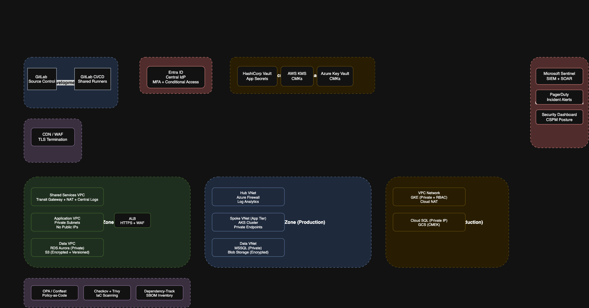
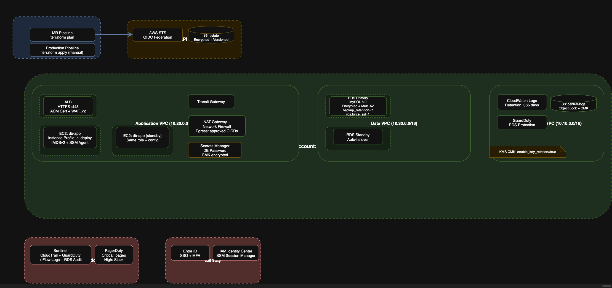

<!-- _class: lead -->

# Cloud Platform & DevSecOps Security Assessment

## Track 2 — Multi-Cloud Government Programme

Panel Presentation · 45 minutes

---

# Executive Summary

**Overall risk posture: Significant gaps requiring immediate remediation.**

- 30 findings from a 12-workload audit sample across AWS, Azure, and GCP
- **13 Critical** — public data exposure, committed credentials, wildcard IAM
- **13 High** — open management ports, disabled encryption, missing detections
- **4 Medium** — key rotation, supply-chain immutability, audit coverage gaps

**Root cause:** The programme grew faster than its security governance. Individual workloads were provisioned without centralised guardrails, consistent encryption standards, or unified identity management.

**Bottom line:** The findings are fixable within the quarter using Terraform-native remediation and a shared CI/CD component library. One COTS exception requires formal compensating controls.

---

# What the Audit Found — and Why It Matters

| Finding class | Module 1 IDs | Real-world parallel |
|---|---|---|
| Public storage buckets | CLD-001, CLD-011 | Two buckets with public access controls disabled |
| Public + unencrypted database | CLD-002, CLD-012 | RDS/Cloud SQL reachable from the internet, no encryption |
| Wildcard CI permissions | CLD-003, CLD-009, CLD-010 | One CI identity with full account access |
| Inconsistent logging | CLD-028, CLD-029 | Flow logs off, Defender Free tier, alerts disabled |
| No centralised detection | CLD-024, CLD-016, CLD-017 | No SIEM, no alerting, no cross-cloud visibility |

**These five classes account for 80% of the Critical/High findings.**

---

# Prioritisation: Why This Order, Not That One

With ~100 workloads and limited bandwidth, we sequence by **blast radius × exploitability × remediation cost**, not just severity.

### P0 — Stop Exposure (13 findings)
Public data, committed credentials, wildcard IAM. **Fix or isolate immediately.**

### P1 — Urgent Control Repair (13 findings)
Open management ports, disabled encryption, missing detections. **Fix in the current wave.**

### P2 — Near-Term Hardening (4 findings)
Key rotation, mutable tags, audit gaps. **Batch into platform backlog.**

**The rationale:** A public bucket affects every user on the internet. A missing key rotation affects one key. Both are "encryption" problems, but the blast radius is completely different.

---

# The Connected Security Story: Identity → Network → Data

### Identity (Module 3)
- OIDC federation replaces static credentials across all three clouds
- CI gets three scoped roles (plan-readonly, deploy-workload, deploy-shared)
- Human access via Entra ID SSO with JIT elevation (no standing admin)

### Network (Module 4)
- Three tiers: public edge → application → data. No workload talks to the internet directly.
- Private endpoints for all data services. Forced egress through centralised firewalls.
- Cross-cloud links for governance traffic only — no cross-cloud runtime.

### Data Protection (Module 5)
- Encryption at rest: BYOK for Tier 1, CMK for Tier 2, platform-managed for Tier 3
- Encryption in transit: TLS 1.2+ everywhere, mTLS between services
- Per-cloud native KMS, governed by a single OPA policy framework

**These three designs are one system, not three independent modules.**

---

# Architecture: High-Level View

*See `10-architecture/hld-diagram.png` for the architecture diagram source.*

---

# Architecture: Low-Level Slice

*See `10-architecture/lld-diagram.png` for the low-level architecture diagram source.*

**One representative path: GitLab CI → production RDS database**

- GitLab runner → OIDC federation → `ci-deploy-workload` IAM role (15-min token)
- `terraform apply` → creates EC2 in private subnet, RDS in data subnet
- EC2 retrieves DB password from Secrets Manager at startup (not from user_data)
- ALB terminates TLS 1.3, forwards to EC2. EC2 connects to RDS with forced TLS.
- VPC flow logs + RDS audit logs → CloudWatch → Sentinel → PagerDuty

**What was in terragoat before:**
- EC2 with public SSH, hardcoded DB password in user_data, wildcard IAM role, unencrypted RDS, no backups

**What exists after remediation:**
- All of the above, replaced by the controls shown here.

---

# The COTS Exception: What We're Asking the Panel

### The constraint
The COTS financial reconciliation tool's driver cannot operate with storage encryption enabled. Vendor says: next major release (estimated 9–12 months).

### Four compensating controls
1. **Private network isolation** — data tier has no internet route. Only one IAM role can reach the bucket, scoped to one prefix.
2. **Real-time access logging** — every API call to the bucket is logged and alerted. 60-second detection SLA.
3. **Strict IAM** — no human has standing access. No delete permission. No bucket policy modification.
4. **Exception tracking** — tagged, tracked, reviewed quarterly, expires in 12 months.

### The ask
**Formal CISO acceptance of residual risk (Medium) with a 12-month expiry.** The exception does not auto-renew. The programme commits to enabling encryption within 12 months or re-platforming the tool.

---

# What the First 90 Days Look Like

### Week 1–2: Emergency remediation
- Revoke all committed credentials. Rotate every exposed password.
- Replace wildcard IAM policies with scoped OIDC roles.
- Move RDS/Cloud SQL to private subnets. Enable encryption on all new resources.

### Week 3–6: Pipeline and detection
- Deploy the shared CI/CD component library to all 100 workload repos.
- Enable GuardDuty, Defender, and SCC across all accounts/subscriptions.
- Stand up Sentinel with CloudTrail, flow logs, and Defender alert ingestion.

### Week 7–12: Hardening and compliance
- Enable encryption at rest on all existing resources (migration plan for RDS).
- Deploy OPA policies for network, IAM, and encryption standards.
- Complete the COTS exception documentation and risk acceptance.
- Run the first quarterly exception review.

**By the end of week 12, every Critical finding is remediated or has a formal compensating control with a documented expiry.**

---

# Go-Forward: How We Prevent This From Happening Again

| Layer | Mechanism | Module |
|---|---|---|
| **Prevention** | Shared CI/CD component library with hard-fail gates on Critical/High | Module 2 |
| **Governance** | OPA policies expressing cross-cloud controls in one rule set | Module 10 |
| **Identity** | OIDC federation — no static credentials in any cloud | Module 3 |
| **Network** | Default-deny segmentation. No workload reaches the internet directly. | Module 4 |
| **Detection** | Centralised SIEM (Sentinel) with provider-specific alerting | Module 6 |
| **Compliance** | Exception register with expiry dates, quarterly review, hard budget of 3 | Module 8/10 |
| **Resilience** | Within-cloud HA (multi-AZ) + cross-region DR (snapshot replication) | Module 13 |

**The programme's security posture is not defined by the absence of findings — it's defined by the speed at which findings are detected, prioritised, and remediated.**

---

<!-- _class: lead -->

# Summary

**30 findings. 13 Critical. Fixable within the quarter.**

- One connected security story: identity → network → data → detection
- One pipeline catching issues before they reach production
- One governance model across AWS, Azure, and GCP
- One COTS exception with formal compensating controls and a 12-month expiry

**The programme can go live securely within the compliance deadline.**
